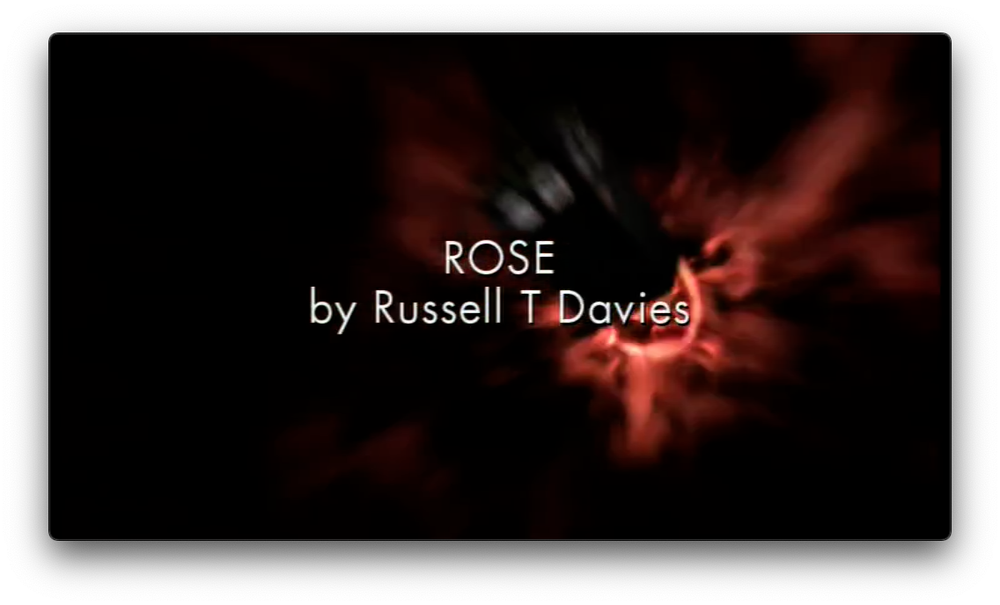
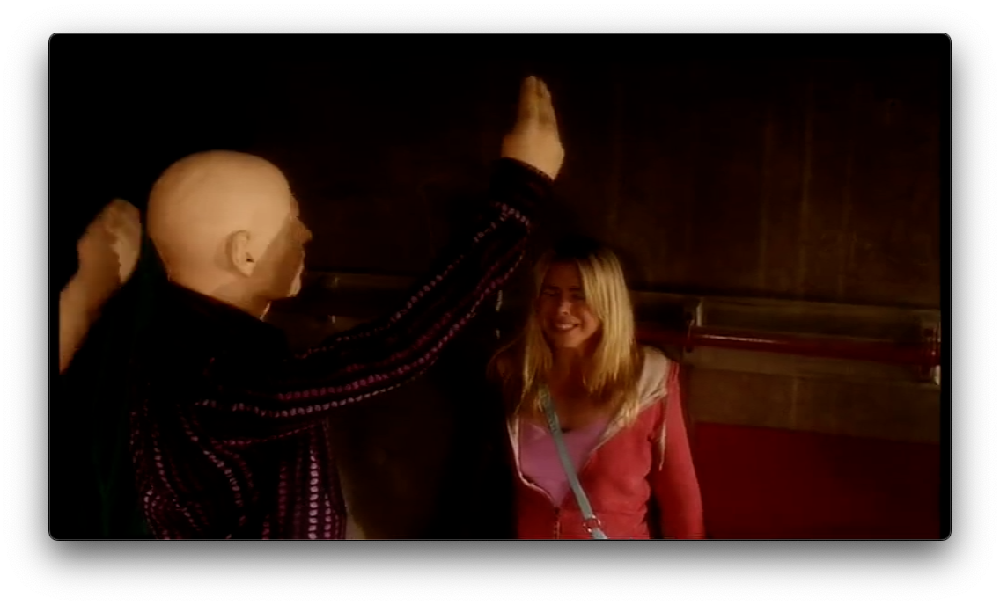
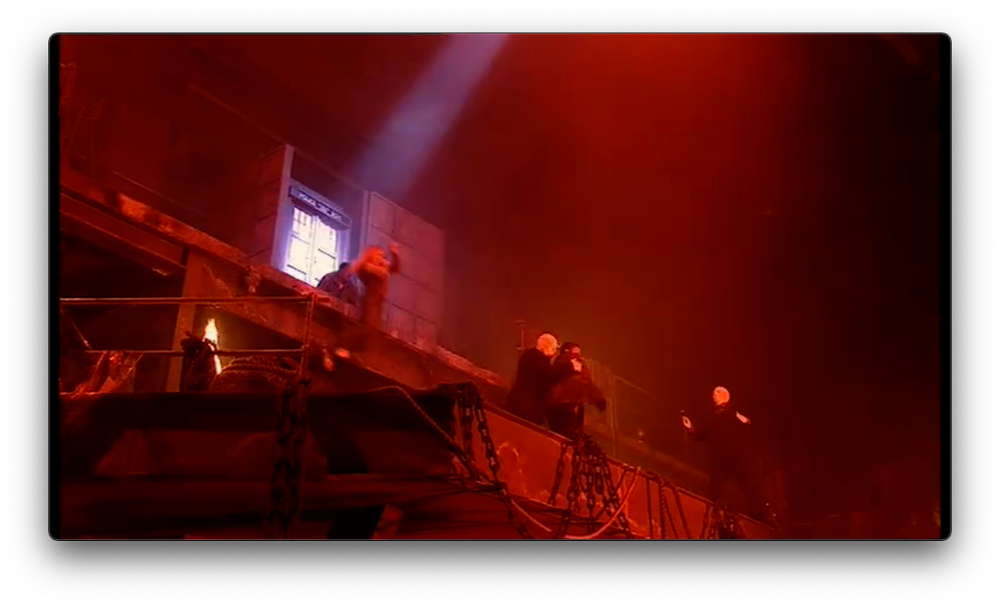
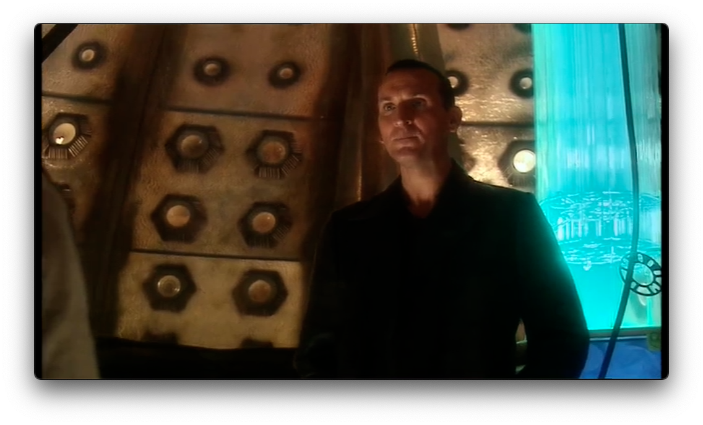

## Intro
What better way to birth a baby (blog) than to talk about Britain for a while right?

But really, Doctor Who has been one of my favourite TV shows for basically as long as I can remember. The Revival of the show is something I'm fascinated by, how the new showrunner managed to bring back a long-missed franchise after a bad streak killed it off.

So here's a (hopefully, if I commit to it) series of posts on the first series of the Revived Era of Doctor Who!

Titlecard for the episode (00:38)

## Classic Who Recap
To start with, you can't really appreciate the revival of Doctor Who without first looking at what made it die in the first place. 

Doctor Who is a lot older than a lot of people realise. While the Revived Era began with Rose in 2005, there was a whole previous run of the show, dubbed Classic, which began all the way in 1963!

This era lasted for over twenty years as a regular series, with its final release being Season 26 in 1989. Following declining ratings in its final years, coupled with a middling 1996 TV movie, the series was cancelled.

## A Reinvention
So now you can probably see the mammoth task that the showrunner, Russel T. Davies, had in store. He not only had to prove that Doctor Who was still a doable concept in the 21st century, as well as try to bring back some fans from the Classic era too. 

*Rose* does this well, by blending elements of Classic into a brand new story with brand new characters. It truly did set the precendent for the next several years of Who, and for that reason, it'll always be one of my favourites.

The Autons attacking Rose (05:23)

## The Story
Looking at it from the perspective of a new fan in hindsight, the story in *Rose* is honestly not all that special or even particularly important. It's a *very* typical New Who story, complete with a pretty neat alien villain, and an actually great arc for Rose by the end.

It follows the 19 year old Rose Tyler, and the normal life she once had being turned upside down once she meets the Doctor, who saves her when she's attacked by plastic window mannequins (known as Autons, curiously not mentioned by name in the episode) at the shop where she works.

She then tries to find out more about the strange man who saved her life, while her boyfriend Mickey has been eaten (?) by the living plastic as well.

The story ends with the Doctor and rose venturing to the Autons' and Nestene Consciousness' hideout underneath the London Eye, and some acrobatics from Rose saving the Doctor from Death by Vat of Plastic.

Rose kicks the Autons into the Nestene Consciousness (38:29)

Perfectly serviceable. But like, this is the first one!! This was *the* beginning! Classic Who had a very different and frankly old vibe to it all, with slower stories, and obviously worse effects and CGI. The revival had an opportunity to modernise all of this, and it did it masterfully. The story is fast paced and has plenty of intrigue, specifically about the identity and especially the past of the Doctor.

## The (Brand New) Doctor
One of the more challenging things for Davies to introduce was probably the Doctor himself. On the one hand, there are so many fans who knew all about him, and this was also of course plenty of people's first Who episode. How do you satisfy both of those camps?

Casting someone new for the role was obvious. The Eighth Doctor portrayed by Paul McGann only appeared in one lukewarm movie almost a decade prior, I doubt he'd want to come back for this role just yet. Davies' choosing the *fantastic* Christopher Eccleston for the role, and crucially, having him regenerate into this form off screen, and recently.

The Ninth Doctor in his TARDIS (27:47)

